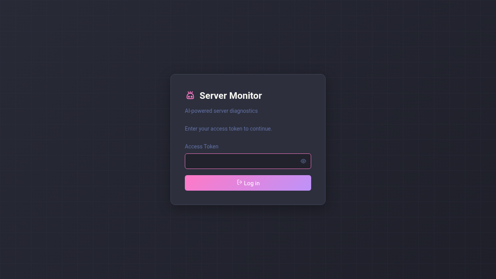
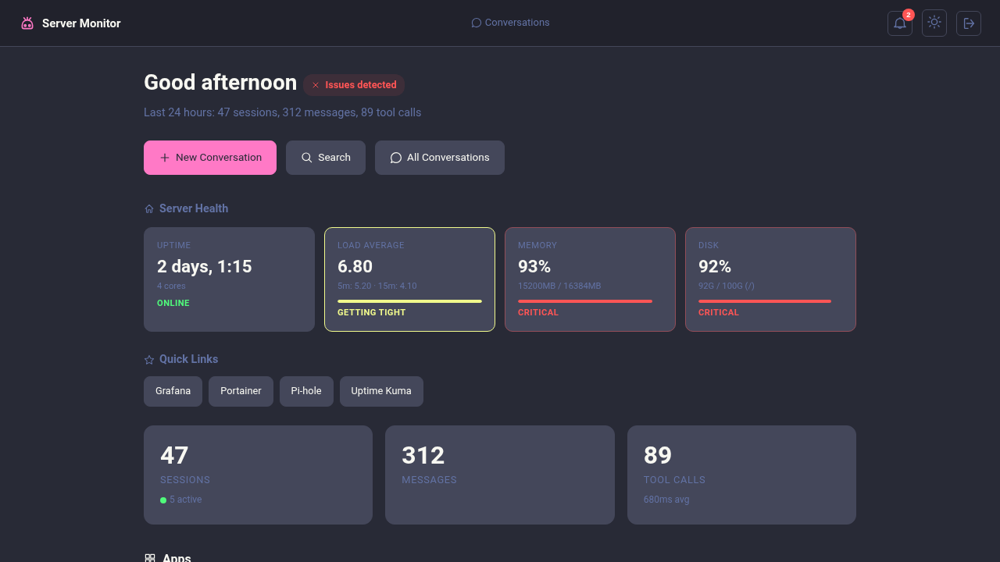
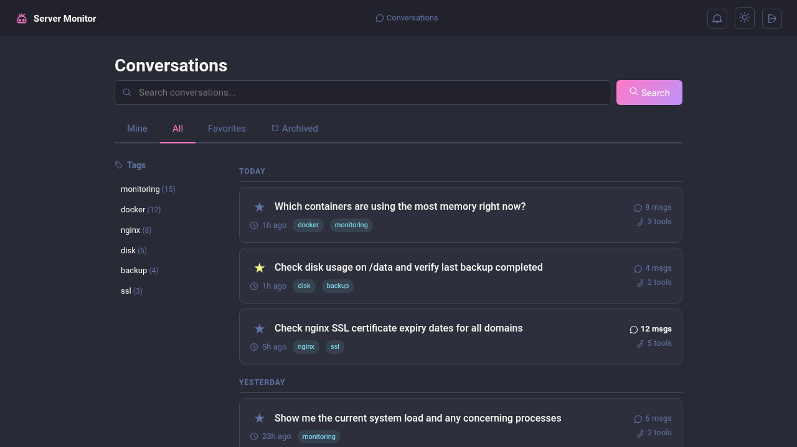
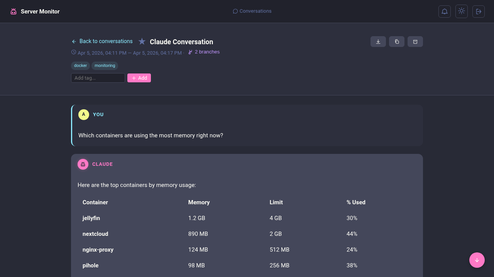
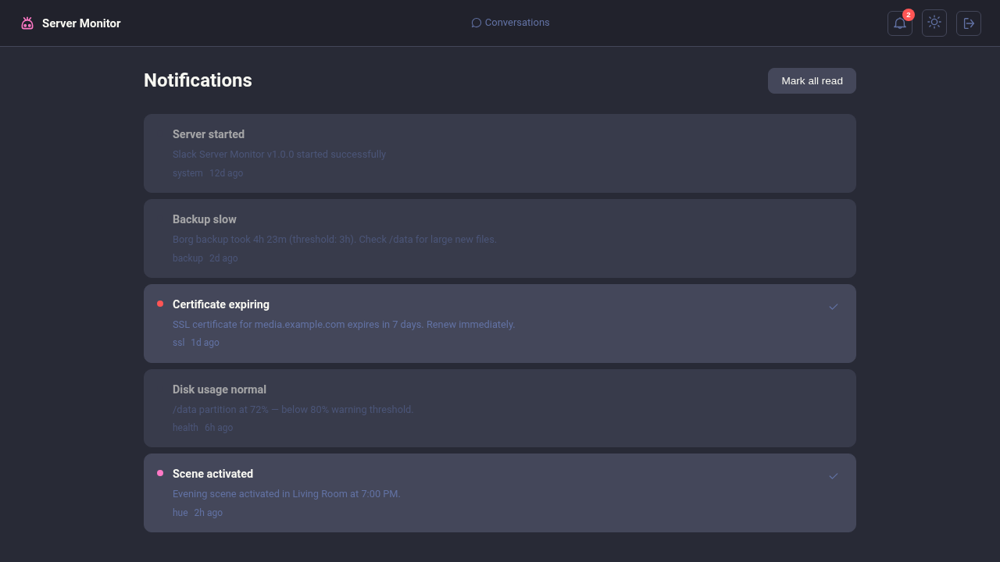
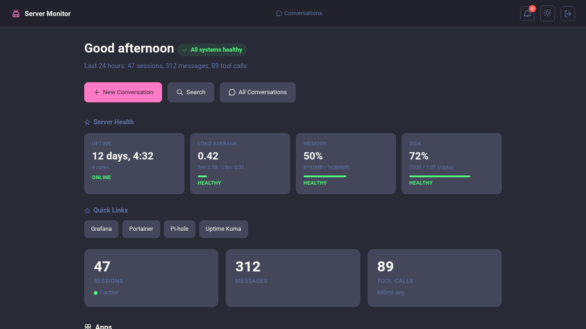
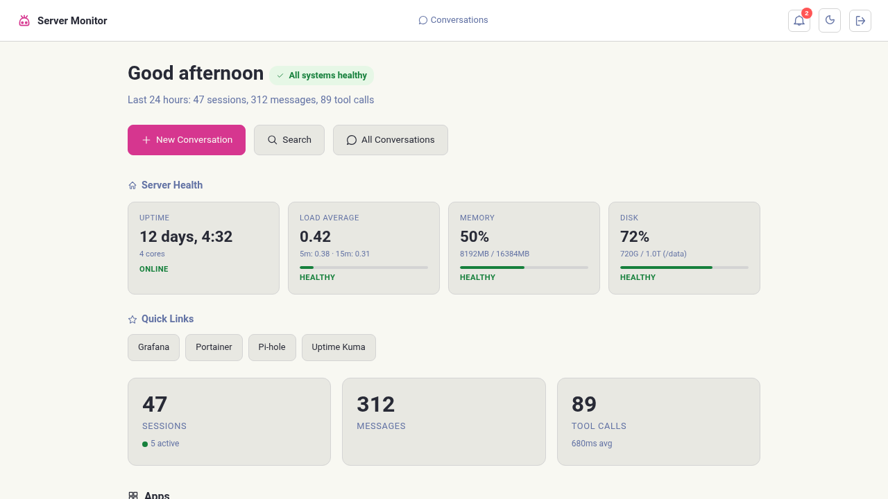
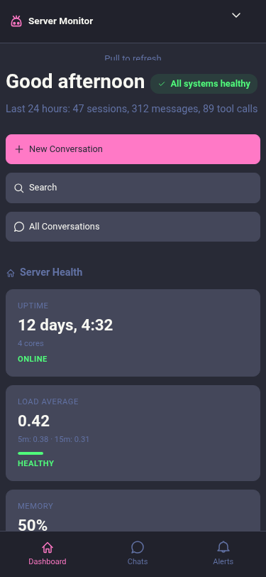
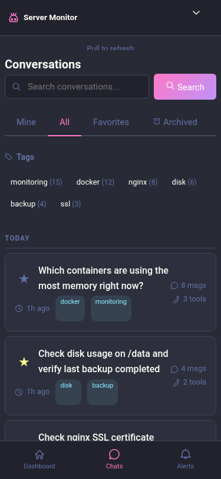

# Web UI

The bot includes an optional web interface for viewing long Claude responses, browsing conversation history, and monitoring server health.

## Enabling

Add to `.env`:

```bash
WEB_ENABLED=true
WEB_PORT=8080
WEB_BASE_URL=http://your-server:8080
WEB_AUTH_TOKEN=$(openssl rand -hex 16)
```

See [Configuration](configuration.md#web-server) for all options.

## Authentication

The web UI uses a two-step authentication flow:

1. **HMAC-signed links** -- When a Claude response exceeds 2900 characters, the bot posts a link containing an HMAC-signed token with the user's Slack ID and an expiry timestamp
2. **Session cookies** -- On first click, the server verifies the HMAC signature, creates an HttpOnly session cookie, and redirects to strip the token from the URL
3. **Subsequent requests** authenticate via the session cookie (no token in URL)

Sessions expire after `WEB_SESSION_TTL_HOURS` (default: 72h) and are cleaned up automatically every hour.

### Login Methods

| Method | How |
|--------|-----|
| **Auto-link** | Click a long-response link posted by the bot |
| **`/weblogin`** | Run the Slack command to get a magic login link |
| **Admin login** | Navigate to `/login` and enter `WEB_AUTH_TOKEN` directly |

Re-login invalidates existing sessions for that user.



## Features

### Dashboard

The home page shows:

- **Server health cards** -- uptime, load average, memory, disk usage (auto-refreshes every 60s)
- **Plugin widgets** -- contributed by plugins via `getWidgets()`
- **Quick links** -- per-user bookmarks (add, remove, reorder)
- **Recent conversations** -- latest Claude AI sessions

When the server is under stress, health cards turn red to surface critical issues at a glance:



### Conversations

- **List view** -- all sessions with search, tabs (All / Starred / Archived), ownership filter
- **Detail view** -- full conversation with collapsible tool calls showing duration and output
- **Controls** -- star/unstar, tag, archive, copy to clipboard, export as Markdown
- **New conversations** -- start fresh from `/c/new`
- **Markdown export** -- `GET /c/:threadTs/:channelId/export/md?tools=true|false`



Conversation detail shows full message history with collapsible tool calls:


Conversations with branch points show fork indicators:



### Notifications

- Bell icon in nav bar with unread badge
- Dropdown with recent notifications
- Full page at `/notifications` with date-bucketed sections (Today / Yesterday / This Week / Older) and level filter pills (All / Unread / Errors / Warnings)
- Plugins can push notifications via `ctx.notify()`



### Themes

- **Dracula** (default) and **Light** themes
- Toggle with the `t` key or the theme button
- Preference persisted in browser

| Dracula (default) | Light |
|---|---|
|  |  |

### Mobile

Responsive layout with hamburger menu at 640px breakpoint.

| Dashboard | Sessions |
|---|---|
|  |  |

## Keyboard Shortcuts

Press `?` anywhere in the web UI to see the full list.

| Key | Session List | Conversation Detail |
|-----|-------------|-------------------|
| `j` / `k` | Navigate cards | Scroll messages |
| `Enter` | Open conversation | -- |
| `s` | Star/unstar | Star/unstar |
| `/` | Focus search | Focus continue input |
| `n` | New conversation | -- |
| `1` `2` `3` | Switch tabs | -- |
| `a` | -- | Archive |
| `c` | -- | Copy to clipboard |
| `e` | -- | Export markdown |
| `h` | -- | Back to list |
| `t` | Toggle theme | Toggle theme |
| `?` | Show shortcuts | Show shortcuts |
| `Esc` | Close/blur | Close/blur |

## REST API

All endpoints require session authentication.

| Method | Path | Description |
|--------|------|-------------|
| GET | `/api/health/server` | Server health metrics (cached 60s) |
| GET | `/api/notifications?unread=true&limit=50` | List notifications |
| POST | `/api/notifications/read-all` | Mark all as read |
| POST | `/api/notifications/:id/read` | Mark single as read |
| GET | `/api/links` | List user's quick links |
| POST | `/api/links` | Add a quick link (`{ title, url, icon? }`) |
| DELETE | `/api/links/:id` | Remove a quick link |
| PUT | `/api/links/reorder` | Reorder links (`{ orderedIds: number[] }`) |

## Security

- Link tokens are HMAC-signed and short-lived (default: 15 minutes)
- Session cookies are HttpOnly + SameSite=Lax (+ Secure flag for HTTPS base URLs)
- HMAC signatures use timing-safe comparison to prevent timing attacks
- Sessions stored in SQLite, cleaned up hourly
- Keep `WEB_AUTH_TOKEN` secret -- it is both the signing key and the emergency admin credential

See [Security](security.md#web-ui-security) for the full model.

## Screenshots

Automated screenshots of all key pages can be generated for documentation and UI review.

### Generate Screenshots

```bash
npm run screenshots              # Capture all pages
npx tsx scripts/take-screenshots.ts dashboard   # Capture one page
```

This starts a standalone server with seed data (no Slack connection needed), launches headless Chromium via Playwright, and captures each page in both themes and viewports.

### What Gets Captured

Each page is captured in its default state plus variant states (empty, error, degraded, etc.) and interactive states (modals open, dropdowns expanded):

| Page | Default | Data variants | Interactive states |
|------|---------|---------------|--------------------|
| Dashboard | Health cards, stats, widgets | `empty`, `degraded` | `notification-bell-open`, `command-palette` (Ctrl+K), `mobile-hamburger-open` (mobile only) |
| Sessions | Conversation list with tags | `empty`, `search-no-results`, `search-results`, `search-results-many`, `favorites`, `archived`, `tagged` | `kb-overlay` (`?`) |
| Conversation | Messages and tool calls | `branched`, `long-with-code`, `truncated`, `tool-error` | `copy-toast` |
| Notifications | Read/unread + filter pills | `empty`, `all-unread`, `many` | — |
| Login / Register | Auth forms | `error`, `prefilled` | — |
| Admin users | Users + invites tables | `empty`, `with-flash`, `deactivated` | `admin-users-reset-pw-open` |
| Error pages | — | — | `401`, `403`, `404`, `500` |

Each state is captured in **Dracula** (dark) and **light** themes, at **desktop** (1280×720), **tablet** (768×1024), and **mobile** (375×812) viewports — about **318 screenshots** across 54 page/variant combinations (some interactive states are viewport-restricted).

### Output

Screenshots are saved to `screenshots/` (gitignored). Naming convention:

```
{page}-{theme}-{viewport}.png              # default state
{page}-{variant}-{theme}-{viewport}.png    # variant state
# e.g., dashboard-dracula-desktop.png
#        dashboard-degraded-dracula-desktop.png
```

A `screenshots/manifest.json` lists every captured PNG with its `{ page, variant, theme, viewport, url, file, hasSetup }`, useful for downstream tooling (visual analysis, perceptual diffing, regression harnesses) so callers don't have to parse filenames.
